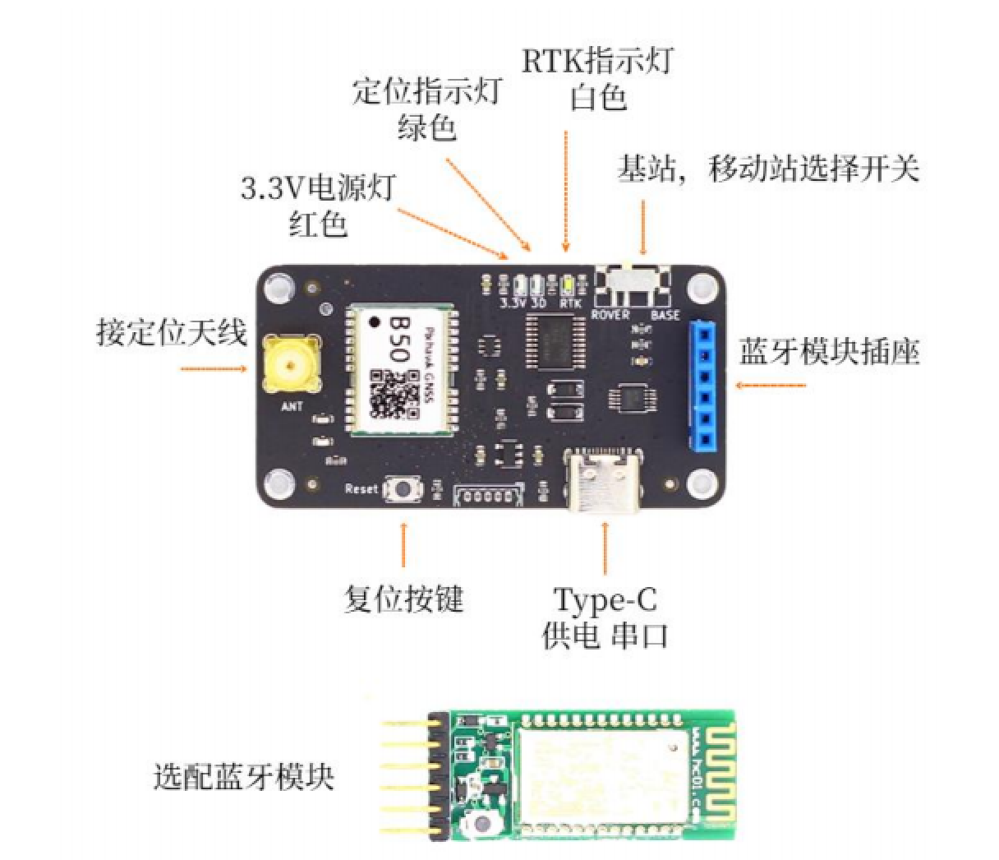
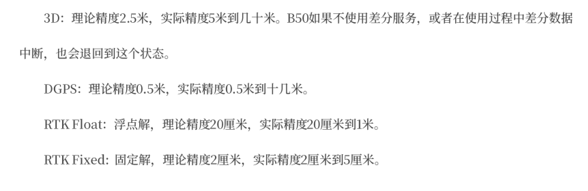

## GPS模块调研
### B50 无人机北斗GPS伽利略三模双频RTK基站移动站均可PX4定位导航
https://item.taobao.com/item.htm?abbucket=2&id=661735136131&mi_id=0000pl8-x7iSdUZNzrAn_PnYJfY2rv1mWaHhKEKKYUeAoaY&ns=1&priceTId=2147851f17555696109282038e0f88&skuId=5702677538652&spm=a21n57.1.hoverItem.16&utparam=%7B%22aplus_abtest%22%3A%2208d5b4eaf4029da41e810e8d89edc41f%22%7D&xxc=taobaoSearch

**更新频率：1hz**

**蓝牙模块：** 汇承HC04，采用 SPP2.1&BLE5.0 蓝牙协议的双模数传模块，即使用蓝牙串口与设备进行通信，在鸿蒙手表端，可以使用@ohos.bluetooth.socket (蓝牙socket模块)来和蓝牙串口设备建立连接，进行数据的接受和发送。

**GPS模块：** B50模块为双频三系统高精度RTK模块，支持北斗3代、GPS以及伽利略导航系统，支持蓝牙模块直插（套餐中为汇承HC04）

板上使用3.3V供电，若使用该模块需要额外配备一块电池

可选择两种模式：基站/移动站
1. 基站：上电后会自动进入求坐标平均值模式并持续三分钟，期间指示灯闪烁且串口无输出，3分钟后B50自动获取一个固定坐标，开始输出RTCM差分数据，此时其他基站可使用此差分数据进行RTK解算。此模式适合多个GPS模块同时使用获取相对位置信息
1. 移动站：上电后立刻开始搜索卫星尝试定位，正常情况下上电1分钟左右定位成功，3D指示灯常亮。如需RTK精确定位，需要将基站差分数据通过串口发送给B50会自动解算。差分数据可以来自自建基站（使用另外一台基站模式的B50），或第三方CORS服务商（付费）

**理论精度：**

### dragy pro
https://godragy.com/

**更新频率：25hz**

自带GPS、蓝牙、六轴传感器、128m内置储存，可记录约30h数据

GNSS：GPS、格洛纳斯、伽利略、北斗四个系统，连接最多可达32颗卫星

IMU：自带六轴：陀螺仪+加速度计

蓝牙模块疑似仅能用于连接手机app下载数据，不确定是否能实时传输数据到其他设备上，我需要发邮件确认一下

### 思路：ESP32 + IMU模块（或使用板载IMU） + GPS
通过ESP32的蓝牙功能，完成esp32与手表通信，同时esp读取imu和gps数据，获得船体姿态与位置。
该方案需要解决：硬件电路、防水问题、供电问题，但成本相较于单一完整的模块更低